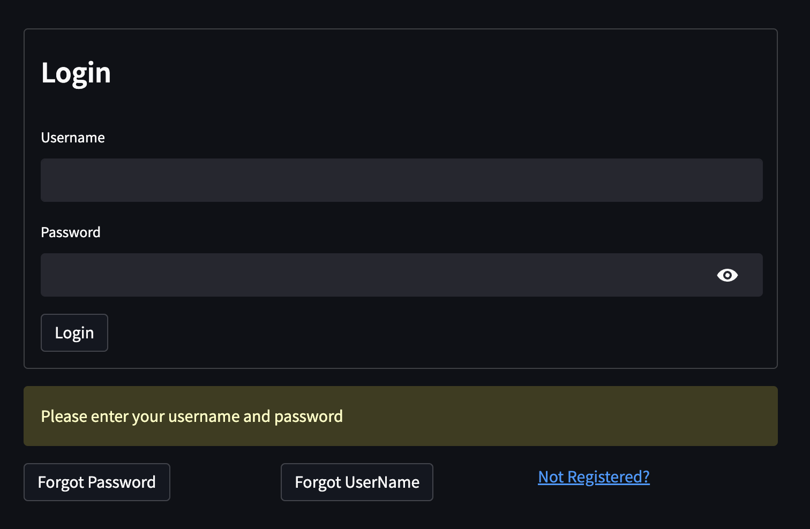

# Cryzelle                                                                                     [Logo.png](Screenshots/Logo.png)
If you want to transfer someone cryptocurrency but you don't remember their 64-character hexadecimal wallet address, what can you do? Do not be alarmed— Cryzelle is here Customers can access the Cryzelle app and register as new users. Once enrolled, users simply need to know each other's phone number or email address in order to send or receive cryptocurrencies instantaneously. Additionally, logged-in users can view their whole transaction history. It can also invite their loved ones to sign up for the bitcoin. the transfer of cryptocurrency using a blockchain transaction to an external wallet or another exchange, utilizing the user's registered email address or phone number for their Ethereum wallet as the "destination address" (the address to which they want to send their bitcoin). We are also integrating Ganache with our project app and leveraging AWS to construct conversations that will serve as data input for transaction information. industry.

## Technologies
This project utilizes a lot of different add ons, please make sure you have all these and they are up to date:

* [VSCode](https://code.visualstudio.com/) - Code editor redefined and optimized for building and debugging modern web and cloud applications.

* [Streamlit](https://streamlit.io/) - Open-source app framework for Machine Learning and Data Science teams.

* [haslib](https://docs.python.org/3/library/hashlib.html) - Secure hash and message digest algorithm library.

* [Web3](https://web3.foundation/) - A Python library for connecting to and performing operations on Ethereum-based blockchains.

* [ethereum-tester](https://pypi.org/project/ethereum-tester/0.1.0a4/) - A Python library that provides access to the tools we’ll use to test Ethereum-based applications.

* [JSON](https://www.json.org/json-en.html) - Used for serializing structured data and exchanging it over a network, typically between a server and web applications.

* [Ganache](https://trufflesuite.com/ganache/) - A program that allows you to quickly set up a local blockchain, which you can use to test and develop smart contracts.

* [PostgreSQL] (https://www.postgresql.org/) To create new database.

* [AWS S3](https://aws.amazon.com/)

* [TruffleSuite] (https://trufflesuite.com/)

* [Twilio] (https://www.twilio.com/)

## Screenshots

# Future Upgrades

# Contributors

- [Theena Dang](https://github.com/Th33na)
- [Drew Herrera](https://github.com/drew94591)
- [Agnes Maria](https://github.com/agnesmaria1)
- [Nayana Narayanan](https://github.com/nayananarayananp)
- [Matthew Stream](https://github.com/MC-Stream)
- [Hugo Velazquez](https://github.com/HugoWLA)

# License
[MIT](license)
